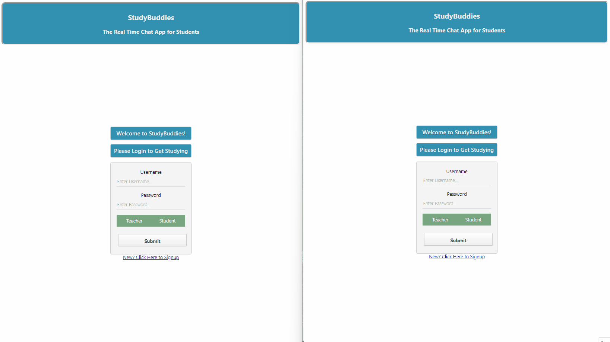

# StudyBuddies

## Description

StudyBuddies is a chat application for students and teachers. Before I left teaching, I noticed a wave of students who were struggling to communicate digitally in any real capacity other than memes. I created this chat app so that teachers can place students in groups and facilitate digital study or learning sessions. The idea is that each chat room stores messages by user and the teacher can utilize these chats to provide feedback or grade using a rubric. After all, words are hard.

## Installation

```bash
npm install
pipenv install
```

## Usage

StudyBuddies is a simple and straightforward chat app.
Users log in as either teacher or student and join the appropriate chat room. Once there, users can activate and deactivate the chat as needed, or send messages for others to read either while connected or later when they connect.



## Credits

Flatiron
Flask-SocketIO
Socket.io